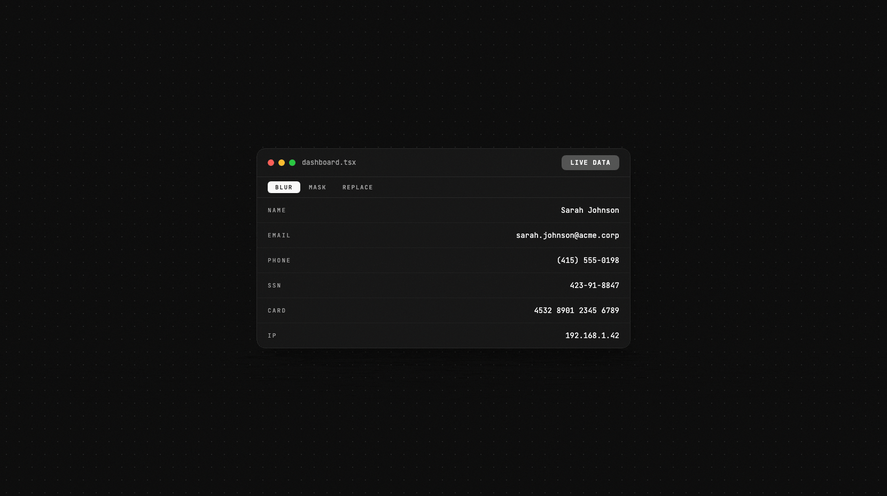
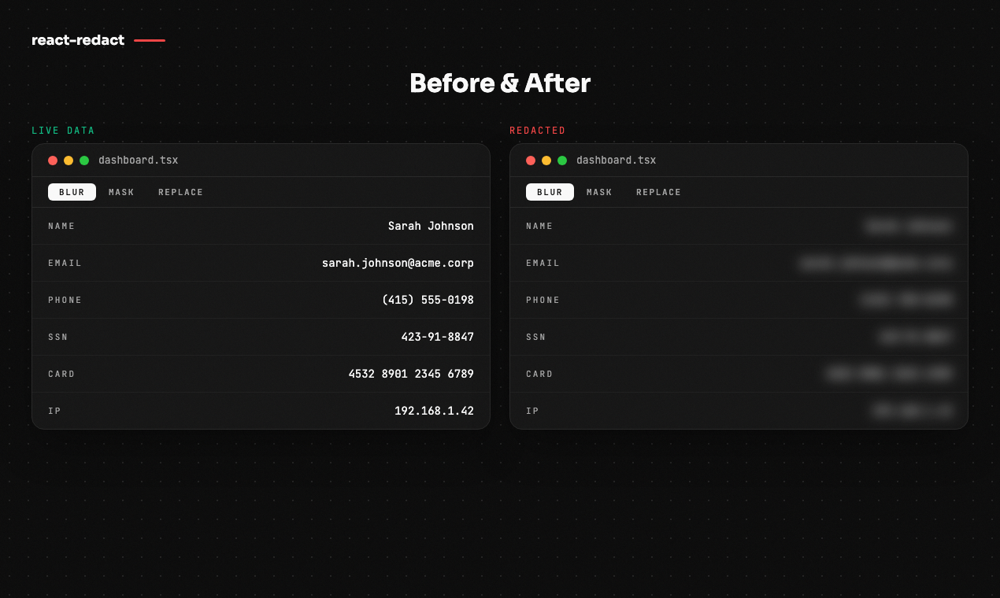
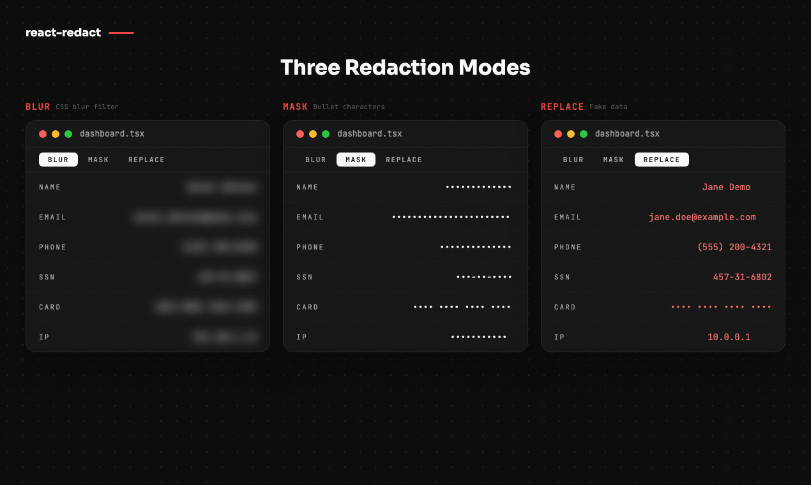
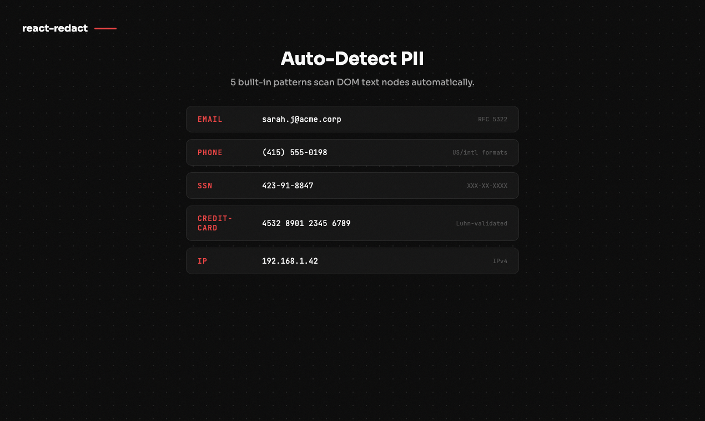

<div align="center">

# react-redact

[](https://www.npmjs.com/package/react-redact)
[](https://www.npmjs.com/package/react-redact)
[](https://bundlephobia.com/package/react-redact)
[](https://www.typescriptlang.org/)
[](./LICENSE)

**One keyboard shortcut to make your entire app demo-safe.**

Zero-dependency React components that visually hide PII — for demos, screenshares, and presentations.

</div>

---

<div align="center">
  
</div>

> **Visual-only:** This is a UI convenience tool for demos and screenshares. It does not remove data from the DOM.

<div align="center">
  
</div>

## Why react-redact?

You're about to share your screen. Your app is full of real customer data — emails, phone numbers, credit cards. You need to hide it **now**, not refactor your entire data layer.

**react-redact** solves this in one line: wrap your app in `<RedactProvider>`, press `⌘⇧X`, and every marked piece of PII is instantly blurred, masked, or replaced with fake data. No backend changes. No environment switching. Just a keyboard shortcut.

## Features

- **Instant toggle** — Keyboard shortcut (`⌘⇧X` / `Ctrl+Shift+X`), `useRedactMode()` hook, or `?redact=true` URL param
- **Three modes** — Blur, mask (bullets), or replace with deterministic fake data
- **Manual wrapping** — `<Redact>` component for known PII fields
- **Auto-detection** — `<RedactAuto>` scans subtrees for email, phone, SSN, credit card, IP (+ custom regex)
- **Custom mode** — Bring your own render function for full control
- **Zero dependencies** — React is the only peer dep. ESM + CJS, tree-shakeable
- **Next.js ready** — `"use client"` directives included, works with App Router out of the box
- **TypeScript-first** — Strict types, exported interfaces, `isolatedDeclarations` compatible

## Install

```bash
pnpm add react-redact
```

## Quick Start

```tsx
import { RedactProvider, Redact, useRedactMode } from "react-redact";
import "react-redact/styles.css";

function App() {
  return (
    <RedactProvider shortcut="mod+shift+x">
      <Dashboard />
    </RedactProvider>
  );
}

function Dashboard() {
  const { isRedacted, toggle } = useRedactMode();
  return (
    <>
      <button onClick={toggle}>{isRedacted ? "🔒" : "🔓"} Demo mode</button>
      <p>Email: <Redact>user@company.com</Redact></p>
      <p>Phone: <Redact>(555) 123-4567</Redact></p>
    </>
  );
}
```

Press **⌘⇧X** (Mac) or **Ctrl+Shift+X** (Windows/Linux) to toggle.

## Modes

<div align="center">
  
</div>

| Mode | What it does | Example output |
|------|-------------|----------------|
| **Blur** | CSS blur filter over original text | ░░░░░░░░░░░ |
| **Mask** | Replaces each character with a bullet | `•••••••••••` |
| **Replace** | Deterministic fake data (same input → same output) | `jane.doe@example.com` |

```tsx
<RedactProvider mode="blur">   {/* default */}
<RedactProvider mode="mask">
<RedactProvider mode="replace">

{/* Or per-component: */}
<Redact mode="replace">user@company.com</Redact>
```

## Auto-Detection

<div align="center">
  
</div>

`<RedactAuto>` scans DOM text nodes for PII patterns and wraps matches automatically:

```tsx
<RedactAuto patterns={["email", "phone", "ssn", "credit-card", "ip"]}>
  <div>{/* any content — PII gets auto-wrapped */}</div>
</RedactAuto>

{/* Add custom patterns: */}
<RedactAuto customPatterns={[/ORDER-\d{6}/g]}>
  <div>Order: ORDER-123456</div>
</RedactAuto>
```

**Built-in patterns:** `email` · `phone` · `ssn` · `credit-card` (Luhn-validated) · `ip`

## API at a Glance

| Export | Type | Description |
|--------|------|-------------|
| `<RedactProvider>` | Component | Context provider — wraps your app, configures mode/shortcut |
| `<Redact>` | Component | Wraps known PII for manual redaction |
| `<RedactAuto>` | Component | Scans a subtree and auto-wraps detected PII |
| `useRedactMode()` | Hook | Returns `{ isRedacted, toggle, enable, disable }` |
| `useRedactPatterns()` | Hook | Read active patterns and add custom ones |
| `getInitialRedactEnabled()` | Utility | Read `?redact=true` from URL for initial state |

## Documentation

Full docs, API reference, and interactive demos:

- **Local:** `pnpm --filter react-redact-docs dev` → [localhost:3001](http://localhost:3001)
- **Content:** [`apps/docs/content/docs`](./apps/docs/content/docs)

## Contributing

Contributions are welcome! Please open an issue first to discuss what you'd like to change.

```bash
git clone https://github.com/btahir/react-redact.git
cd react-redact
pnpm install
pnpm run build
pnpm test:run
```

## License

[MIT](./LICENSE)
